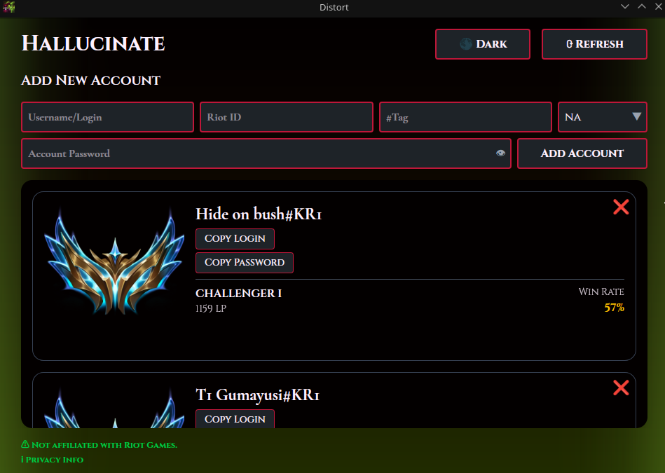

# Hallucinate

> Got too many League of Legends accounts?  
> Tired of digging through spreadsheets just to find your rank?  
> **Hallucinate** has your back.

**Hallucinate** is an open-source desktop app for managing all your League of Legends accounts in one place. Inspired by tools like _Deceive_, this Shaco-flavored manager helps you organize account names and check public rank info all locally.

  

  
  
  
  

---

## 🔒 Privacy First

- All data stays on your computer  
- No Riot credentials are ever stored or requested  
- No external database or API  
- Encryption ensures your data remains secure

---

## 🎯 Key Features

- Save and label multiple League of Legends accounts  
- Instantly fetch public **rank**, **tier**, **winrate**, and more  
- All rank icons courtesy of Riot Games  
- Fully local

---

## 🧰 Tech Stack

Built with a modern full-stack setup for speed, security, and portability:

- **Frontend**: React + Vite + Tailwind CSS  
- **Backend**: Node.js + Express + SQLite (local storage)  
- **Desktop Shell**: [Tauri](https://tauri.app/)  
- **Package Management**: npm + Cargo (for Tauri)

---

## 📁 Assets & Credits

- All rank icons and tier images are property of **Riot Games**  
- This project is **not affiliated** with Riot Games  
- Built for **local use only**, using Riot’s **public API** for summoner info

---

## 📝 License

[MIT License](LICENSE)

---

> Hallucinate: because managing accounts shouldn't feel like fighting clones.
